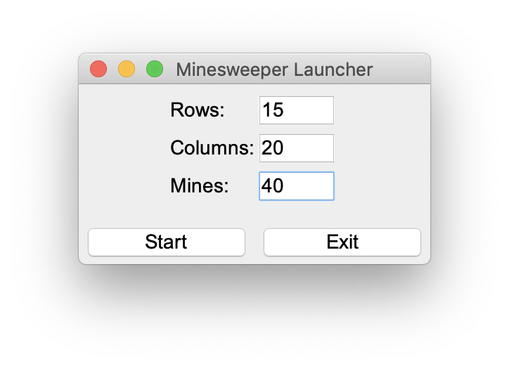
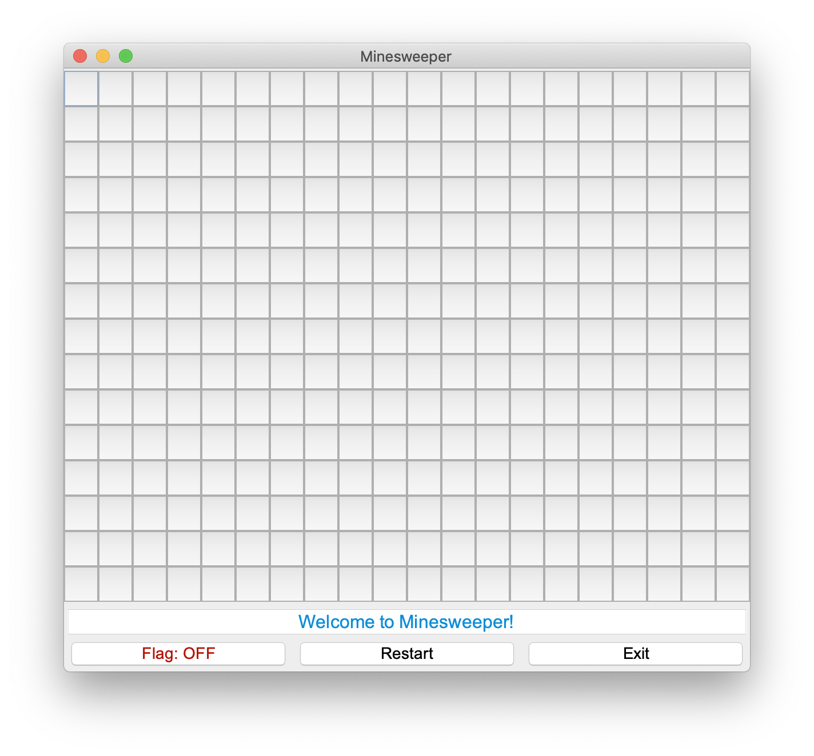
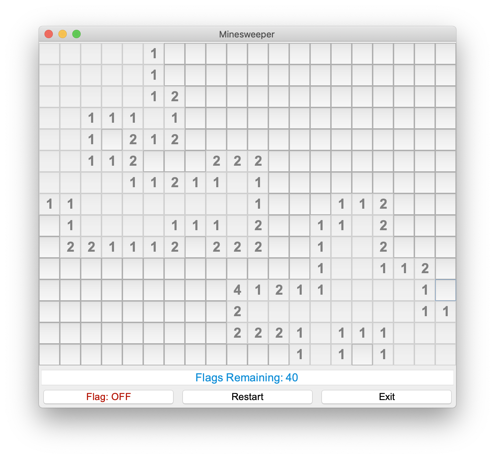
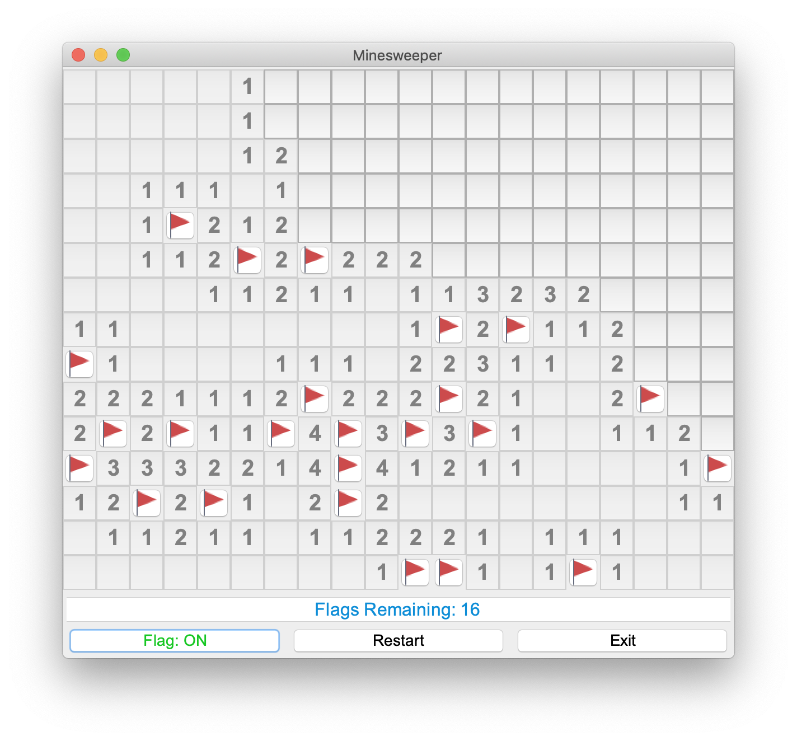
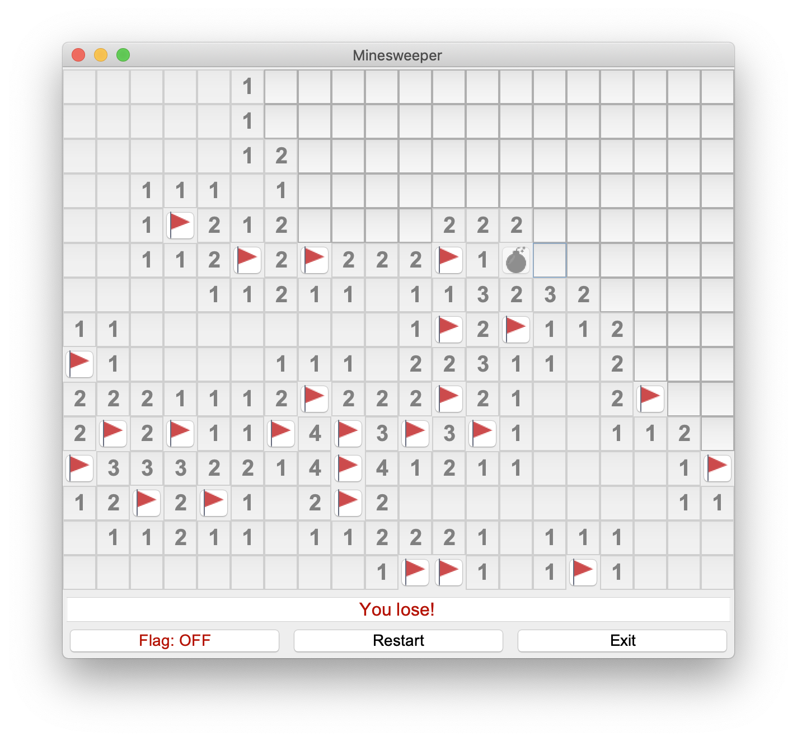
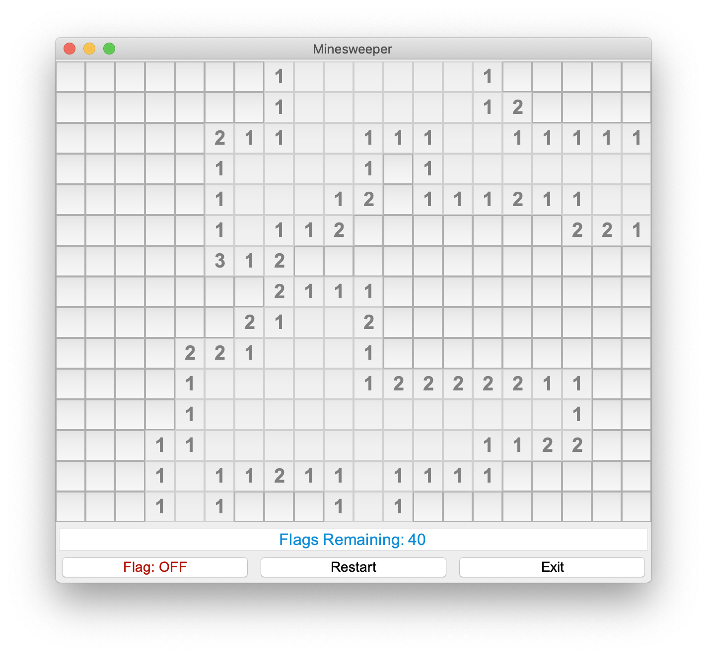
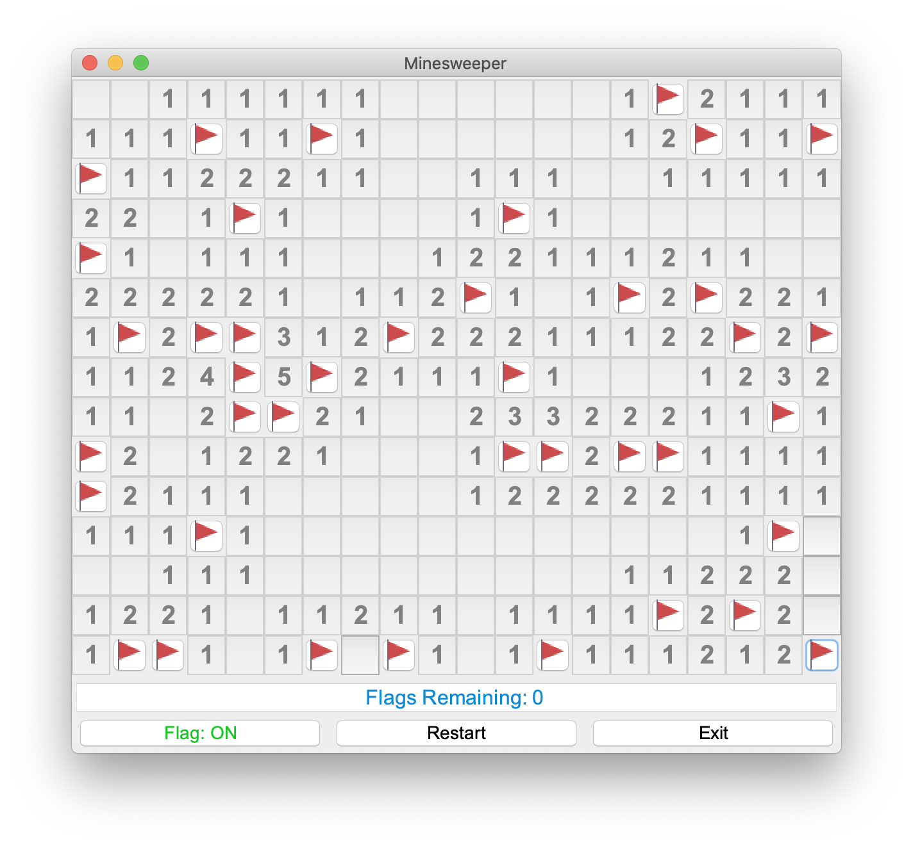
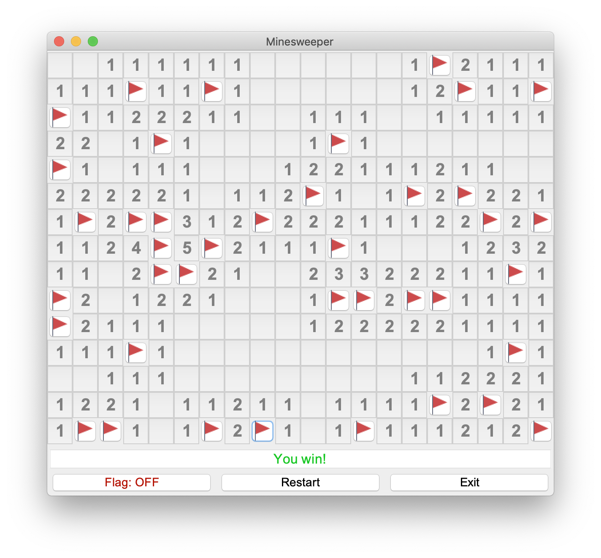

# Minesweeper
Simple Minesweeper game made with Java.

## Requirements
An operating system with lastest of Java Runtime Environment installed.

## Downloading
Lastest JAR file can be downloaded in the [Releases](https://github.com/810Teams/Minesweeper/releases) tab. After downloading, just double-click to run the game.

## Features
### Board Creation
Start a game with board creation frame, fill in your prefered board properties.

### Game Board
By clicking start, the board will appear before you and ready to play.

### Clicking
Clicking the board cell will reveal the value of the cell. The value determines mines amount around the specified cell.

### Flagging
While in flag mode, flags will be pinned to the cells clicked. Try to flag all the mines on the board without getting any mine exploded.

Please keep in mind that you have limited number of flags, which is equal to the number of mines.

### Losing
If the cell containing a mine is clicked, you will instantly lose.

### Restarting
After losing, or maybe not, you can always restart the game. Restarting will also re-generate location of the mines.

### Near Win
Even with all flags on the mine cells, you still need to reveal all non-mine cells. This process is to prevent guessing.

### Winning
Winning can be done by flagging all mine cells and revealing all non-mine cells. After winning, you can always restart the game.

